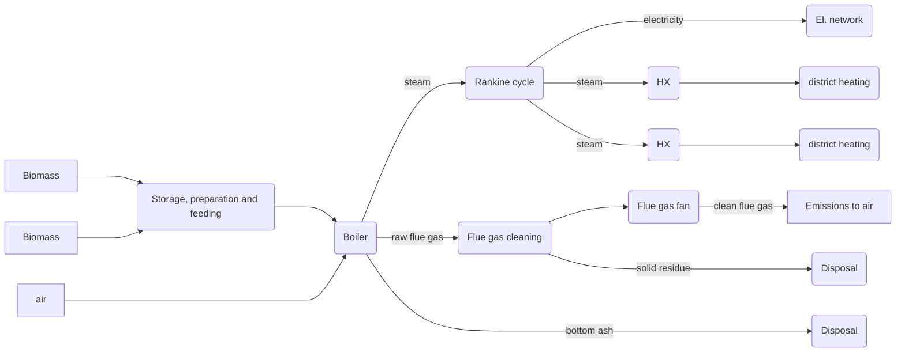

# [BioCHP plant module](@id back-bio_CHP)

The BioCHP plant module incorporates the following mass/energy streams and unit process operations:



The model includes the following main processes:

1. Supply, storage and handling of the solid biomass,
2. Combustion of the biomass with recovery of the combustion heat for production of superheated steam,
3. Direct utilization of the steam for production of electricity in steam turbine
4. Production of heat through extractions from the steam turbine
5. Cleaning of the raw flue gas after combustion to remove particulate matter, acid gases and volatile organic components.

The capacity of the bioCHP plant is defined in term of the total power output from the biomass boiler, calculated from the electric power and heat demands.
The model considers two sold residues, *i.e.*, bottom ash from the boiler and residue from flue gas cleaning containing fly ash and consumed lime.

Important features of the mode includes:

- The feedstock is defined as a mixture of several type of *Biomass* resources.
- Multiple heat demands, specified by thermal Power, temperature and pressure, for **district heating** (each through a heat exchanger) or as **direct steam export*.

The module is implemented as a nonlinear C++ model.
It allows for multiple different configurations
It is not directly linked to `EnergyModelsX`.
Instead, a simpling routine for capturing both the costs (capital expenditures and operating expenses) as well as the performance (heat to power production and varying power levels) will be implemented in a later stage.
This sampling routine allows a tight integration of the model within the `EnergyModelsX` framework.

## [Parameters](@id back-bio_CHP-par)

The parameters of the BioCHP plan model can be differentiated into external inputs and internal parameters as defined below.

### [Inputs](@id back-bio_CHP-par-inp)

The first relevant input category is related to the used biomass in the CHP plant.
The biomass is included in the module through a combination of strings.
It is hence necessary to use the strings specified within the module.
The following input is required for the biomass feed:

- none (`fuel_def` in the model as `vector[string]`) is the type of biomass.
  Multiple biomass types can be provided to the module, *e.g.*, `spruce_bark`.\
  The current implemented feedstock strings are `spruce_stem`, `spruce_bark`, `spruce_T&B` and `birch_stem`.
- ``Y_j^F`` (`Y_fuel[j]` in the model as `vector[double]`) is the mass fraction of biomass resource ``j`` in the feed.
  The total mass fraction must sum to 1.
- ``Y_{H_2O,j}^F`` (`YH2O_fuel[j]` in the model as `vector[double]`) is the moisture content of biomass resource ``j`` as mass fraction.
  It corresponds to the water content in the total wet mass.

In addition, we have to provide the input for the desired plant characteristics.
This input can be specified by the user through text file, although upper bounds may exist for some variables.
The following input is required for the plant characteristics:

- ``T_{h,k}`` (`T_h[k]` in the model as `vector[double]`) is the temperature level of heat demand ``k`` in °C.
  As the CHP plant can provide heat at several temperature levels, it is possible to specify them directly.
- ``P_{h,k}`` (`P_h[k]` in the model as `vector[double]`) is the outlet pressure of heat demand ``k`` in bar gauge.
  This implies that you have to provide the pressure through subtracting the ambient pressure.
  The combination of the temperature and the pressure determines whether the heat is supplied as steam or as hot water.
- ``\dot{Q}_{k}`` (`Q_h[k]` in the model as `vector[double]`) is the heat demand at the individual temperature and pressure levels ``k`` in MW.
  The heat demands are
- ``\dot{W}_{el}`` (`W_el` in the model as `double`) is the electric power output of the CHP plant in MW.

!!! note "Vector positions"
    Both the input biomass and heat demands are specified as vectors.
    This implies that the position of the types of biomass, their mass fraction, and the moisture content requires a correct indexing.
    Similarly, the thermal power, temperature and pressure conditions of the heat demands are required to follow the correct indexing.

### [Internal](@id back-bio_CHP-par-int)

The different biomass have furthermore a set of internal parameters.
These parameters describe the characteristics of the biomass that are fundamental properties of the respective biomass.
Adding a new type of biomass requires hence the addition of the following parameters:

- ``Y_{i,j}^F`` (`Yi.fuel[j]` in the model) is the atomic composition of biomass ``j`` in kg/kg dry basis, that is without any water content.
- ``Y_{ash,j}^F`` (`Yash.fuel[j]` in the model) ; is the ash content in biomass ``j`` (kg/kg dry basis)
- ``LHV_j^F`` (`LHV.fuel[j]` in the model) is the lower heating value of biomass ``j`` in MJ/kg.
- ``x`` is the hydrogen to carbon atomic molar ratio.
- ``y`` is the oxygen to carbon atomic molar ratio.

Furthermore, process characteristics can be specified internally:

- ``\lambda_{air}^{comb}`` (`lambda_comb` in the model) is the excess air in combustion process (-).
- ``T_{stm}^{boiler}`` (`T_stm` in the model) is the **Boiler** steam temperature in °C.
- ``P_{stm}^{boiler}`` (`P_stm` in the model) is the **Boiler** steam pressures in bar gauge.
- ``\eta_S^{ST_n}`` (`eta_s[n]` in the model) is the isentropic efficiency for steam turbine stage ``n``.
  The individual steam turbines of the rankine cycle can have different isentropic efficiencies.

!!! tip "Format of the parameters"
    All internal parameters are required as `double` types in the model.

## [Outputs (standard)](@id back-bio_CHP-par-out_stand)

The standard output of the model is given as

- ``\dot{M}_F`` (`M_fuel` in the model) is the input mass flow rate of biomass to BioCHP plant in kg/s.
- ``\dot{H}_F``;(`H_fuel` in the model) Input energy flow rates of biomass to BioCHP plant in MW.
- ``C_{inv}``(`C_inv` in the model) are the capital expenditures in M\$.
- ``C_{op,d}`` (`C_op_d` in the model) are the annual direct variable operating expenses in M\$.
  It is assumed that the plant operate at XXX h/year at full capacity.
- ``C_{op,f}`` (`C_op_f` in the model) are the annual fixed operating expenses in M\$.

!!! tip "Format of the outputs"
    All outputs are required as `double` types in the model.

## [Mathematical formulation](@id back-bio_CHP-math)

### [Mass and energy flows (nominal steady state operation)](@id back-bio_CHP-math-balances)

Considering

1. a biomass mixture defined by the mass fraction of each type of feedstock in the mixture ``Y_j^F``,
2. the net power production from the Rankine cycle ``\dot{W}_{el}^{RK}``, and
3. the external heat demands ``\dot{Q}_{k}``

as inputs, the total energy rate of the input biomass to the CHP plant ``\dot{H}_F`` with ``N_q`` steam extractions to cover heat demands is calculated as

```math
\dot{W}_{el}^{RK} = \sum_{n=0}^{N_q} \left(\dot{H}_F \frac{(q_{stm}^{boiler}/h_{fuel})}{(h_{stm}^{boiler}-h_{bfw}^{boiler})} - \sum_{k=0}^n {\dot{Q}_{k}/(h_{stm}^{k}-h_{o}^{k})} \right) (h_{in}^{ST_n}-h_{out,s}^{ST_n})\eta_S^{ST_n}
```

with

```math
q_{stm}^{boiler} = [h_{fuel} - h_g^{FGC} - h_{ba}^{boiler} - h_{s}^{FGC}]/(1-q_{loss}),
```

that is the difference in mass enthalpy between the biomass fuel and the output from the system, that is the flue gas, the fly ash, and the bottom ash.
The value ``q_{loss}`` corresponds in this situation to the fraction of heat loss.

The specific enthalpy of the fuel is calculated through the lower heating values of the individual biomass resources (indexed through ``j``), excluding the moisture in the resources (indexed throguh ``H_2O``):

```math
h_{fuel} = \sum_j Y_j^F[(1-Y_{H_2O,j}) LHV_j-Y_{H_2O,j}h_{v,H_2O}]
```

The specific enthalpy of the combustion gas can be calculated through the difference between its temperature and the reference temperature ``T_0``, the heat capacities ``c_{p,g,j}`` as well as

```math
h_g^{FGC}  = (T_g^{FGC}-T_0) \sum_j {Y_j^F c_{p,g,j} \left(Y_{H2O,j}+(1-Y_{H2O,j})[1+\lambda_{air}^{comb} Y_{C,j}(W_{air}⁄W_C)(1+x/4-y/2)]\right)}
```

Here ``W_{air}`` and ``W_C`` are the molecular weight of air (28 g/mol) and atomic weight of carbon (12 g/mol).

The specific enthalpy of the bottom ash is given by

```math
h_{ba}^{boiler}  = [c_{ba} (T_{ba}^{boiler}-T_0) + Y_{C,ba}h_C] f_{ba}\sum_j {[\dot{Y}_j^F (1-y_{H2O,j}) Y_{ash,j}^F]}
```

with ``c_{ba}`` being the specific heat capacity of the bottom ash, ``f_{ba}`` being the fraction of the total ash produced as bottom ash, and ``Y_{C,ba}`` is the mass fraction of carbon in the bottom ash.
The the specific enthalpy of the flue gas per unit mass feedstock is given by

```math
h_{s}^{FGC}  = (T_{s}^{FGC}-T_0) [m_{lime}c_{lime} + f_{fa} c_{fa}\sum_j {\dot{Y}_j^F (1-Y_{H2O,j}) Y_{ash,j}^F}]
```

with ``c_{fa}`` being the specific heat capacity of the fly ash and ``f_{fa}`` being the fraction of the total ash transfer as fly ash to the flue gas.

!!! note "Specific enthalpies"
    All specific enthalpies described above are relative to the mass flow of the biomass feedstock ``\dot{M}_F``.

Using the calculated value for ``\dot{H}_F``, other material and energy flows for the BioCHP plant are calculated:

- Mass flow rate of the biomass mixture and of each feedstock ``j``:

  ```math
  \begin{aligned}
    \dot{M}_F & = \dot{H}_F/h_{fuel} \\
    \dot{M}_j^F & = \dot{M}_F \sum_{j=1}^{N_j} Y_j^F \\
  \end{aligned}
  ```

- Mass flow rate and energy flow rate of bottom ash (``ba``) from the boiler:

  ```math
  \begin{aligned}
    \dot{M}_{ba}^{boiler} & = \dot{M}_F (1+Y_{C,ba}) f_{ba} \sum_j Y_{ash,j}^F \dot{Y}_j^F (1-Y_{H2O,j}) \\
    \dot{H}_{ba}^{boiler} & = \dot{M}_F h_{ba}^{boiler} \\
  \end{aligned}
  ```

- Inlet mass flow rate of lime to flue gas cleaning:

  ```math
  \dot{M}_{lime} = \dot{M}_F m_{lime,b} \sum_j \frac{Y_{S,j} +Y_{Cl,j}}{Y_{S,b}+Y_{Cl,b}}
  ```

- Mass flow rate and energy flow rate of solid residue (``s``) from the flue gas cleaning:

```math
  \begin{aligned}
    \dot{M}_{s}^{FGC} & = \dot{M}_F [m_{lime} + f_{fa} \sum_j {\dot{Y}_j^F (1-Y_{H2O,j}) Y_{ash,j}^F}] \\
    \dot{H}_{s}^{FGC} & = \dot{M}_F h_{s}^{FGC} \\
  \end{aligned}
```

- Mass and energy flow rates of flue gas from the CHP plant:

  ```math
  \begin{aligned}
    \dot{M}_{g}^{FGC} & = \dot{M}_F \sum_j {\dot{Y}_j^F[Y_{H2O,j}+(1-Y_{H2O,j})[1+\lambda_{air}^{comb} Y_{C,j}(W_{air}⁄W_C)(1+x/4-y/2)]]} \\
    \dot{H}_{g}^{FGC} & =  \dot{M}_F h_g^{FGC} \\
  \end{aligned}
  ```

- Thermal energy and mass flow rates of steam (``stm``) produced from the boiler:

  ```math
  \begin{aligned}
    \dot{Q}_{stm}^{boiler} & = [\dot{H}_{fuel} - \dot{H}_g^{FGC} - \dot{H}_{ba}^{boiler} - \dot{H}_{s}^{FGC}]/(1-q_{loss}) \\
    \dot{M}_{stm}^{boiler} & = \dot{Q}_{stm}^{boiler}/(h_{stm}^{boiler}-h_{bfw}^{boiler}) \\
  \end{aligned}
  ```

### [CAPEX](@id back-bio_CHP-math-CAPEX)

The installed cost of equipment ``k`` is calculated from

```math
C_{eq,k} = C_{P,k}^B (S_k⁄S_k^B)^{n_k} (I⁄I_B ) f_{inst,k},
```

where ``C_{P,k}^B`` is the purchase equipment cost for a base-case equipment size ``S_k^B`` and the reference year (base), ``S_k`` is the actual size of the equipment, ``n_k`` is the equipment scale factor, and ``f_{inst,k}`` is the equipment installation factor. ``I⁄I_B`` is the price index ratio between the actual year and the reference year.
It can be evaluated using the Chemical Engineering Plant Cost Index (CEPCI).

The following quipment cost parameters are used:

| Equipment | ``S_k^B`` | ``C_{P,k}^B`` (\$M) | ``f_{inst,k}`` | ``n_k`` | Base year |
| :------ | ---: | ---: | ---: | ---: | --: |
| Biomass storage and preparation | 25 t/h | 5.4 | 2.1 | 0.5 | 2007 |
| Biomass boiler | 25 t/h | 7.9 | 2.1 | 0.7 | 2007 |
| Flue gas cleaning | 67 t/h | 0.18 | 2.7 | 0.7 | 2007 |
| Steam turbines and condenser | 1500 MW | 40.5 | 1.3 | 0.7 | 2006 |
| Heat Exchanger (heat export) | 100 m² | 0.086 | 2.8 | 0.71 | 2012 |

The total equipment cost is then given by

```math
C_{eq} = \sum_k C_{eq,k}
```

The total capital expenditures (CAPEX) is evaluated in terms of the total permanent investment ``C_{inv}`` from:

```math
C_{inv} = \sum_k C_{eq,k} (1+f_{pip}+f_{el}+f_{I\&C})[(1+f_{site}+f_{building})+f_{com}](1+f_{cont,k}+f_{eng,k})(1+f_{dev})
```

where ``C_{eq,k}`` denotes the installed cost of equipment, and ``f_i`` are cost parameters defined as

- ``f_{pip} = 0.065`` for interconnecting piping between equipment,
- ``f_{el} = 0.05`` for plant electric system,
- ``f_{I\&C} = 0.05`` for instrumentation and control system,
- ``f_{site} = 0.17``  for land and site preparation,
- ``f_{building} = 0.20`` for construction of buildings,
- ``f_{com} = 0.10`` for commissioning, and
- ``f_{dev} = 0.02`` for project development and licenses.
- ``f_{eng,k} = 0.15`` for engineering
- ``f_{cont,k} = 0.20`` for contingency

### [OPEX](@id back-bio_CHP-math-OPEX)

The OPEX is defined as total annual operating costs calculated from

```math
C_{op} = C_{op,d} + C_{op,f},
```

where:

- ``C_{op,d}`` denotes the variable operating cost, proportional to the annual operating time ``t_{op}``, including the
  - supply of biomass with a unit price of 100 \$/t,
  - purchase of lime with a unit cost of 0.25 \$/kg,
  - disposal of flue gas cleaning solid residue with unit cost of 40.0 \$/t, and the
  - disposal of bottom ash with unit cost of 20.0 \$/t
- ``C_{op,f}`` are fixed operating costs required for having the BioCHP plant in activity includin the
  - maintenance cost:

    ```math
    C_{maint} = 0.05 C_{eq}
    ```

  - insurance:

    ```math
    C_{ins} = 0.01 C_{inv}
    ```

  - administration and site services:

    ```math
    C_{adm} = 0.03 C_{inv}
    ```

  - labor cost:

    ```math
    C_{labor} = \sum_k{N_k^{labor} c_{b,k}^{labor}[1+f_{oh,k}^{labor}]}
    ```

    with subscript ``k`` denoting the personnel categories, ``N_k^{labor}`` are the number of employees in each personnel category, ``c_{b,k}^{labor}`` is the net annual cost for each personnel category, and ``f_{oh,k}^{labor}`` is the overhead cost.

The balues for the cost parameters for each personnel categories are:

1) plant manager:

   ```math
   \begin{aligned}
     c_{b,k}^{labor} & = 162~k\$/year \\
     N_k^{labor} & = 1 \\
     f_{oh,k}^{labor} & = 0.0 \\
   \end{aligned}
   ```

2) O&M manager:

   ```math
   \begin{aligned}
     c_{b,k}^{labor} & = 96~k\$/year \\
     N_k^{labor} & =
       \begin{cases}
         1 ,& \text{if} ~ \dot{M}_F < 10 \text{t/h} \\
         2 ,& \text{if} ~ \dot{M}_F > 10 \text{t/h} \\
       \end{cases} \\
     f_{oh,k}^{labor} & = 1.2 \\
   \end{aligned}
   ```

3) O&M engineer::

   ```math
   \begin{aligned}
     c_{b,k}^{labor} & = 88~k\$/year \\
     N_k^{labor} & =
       \begin{cases}
         1 ,& \text{if} ~ \dot{M}_F < 10 \text{t/h} \\
         2 ,& \text{if} ~ \dot{M}_F > 10 \text{t/h} \\
       \end{cases} \\
     f_{oh,k}^{labor} & = 1.2 \\
   \end{aligned}
   ```

4) shift operator:

   ```math
   \begin{aligned}
     c_{b,k}^{labor} & = 37~k\$/year \\
     N_k^{labor} & =
       \begin{cases}
         3 ,& \text{if} ~ \dot{M}_F < 10 \text{t/h} \\
         6 ,& \text{if} ~ \dot{M}_F > 10 \text{t/h} \\
       \end{cases} \\
     f_{oh,k}^{labor} & = 1.3 \\
   \end{aligned}
   ```

!!! note "Number of employees"
    The number of employess is depending on the size of the plant.
    The chosen distinction is based on the mass flow of biomass into the plant ``\dot{M}_F`` with a differentiation included at a change in the flow of 10 t/h.

## [File structure](@id back-bio_CHP-file_struct)

**`bioCHP.cpp`**  contains the C++ function to interface with EMX.
It has the following structure:

```REPL
├── Definitions.h
├── Costs.h
├── Flows
│   ├── Flow_definitions.h
│   ├── Flow_calculations.h`
│   └── Thermodynamics
│       └── Water_thermodynamics.h
└── Processes
    ├── bioCHP_plant.h
    ├── Combustion.h
    ├── Rankine_cycle.h
    └── Flue_gas_cleaning.h
```